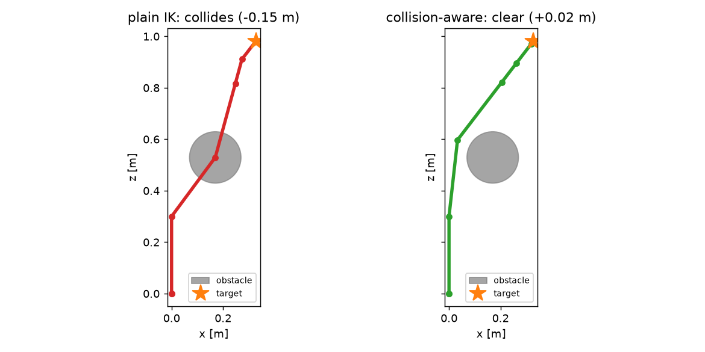

# kinfast

[](https://github.com/VihanAggarwal/kinfast/actions/workflows/tests.yml)

Robot kinematics and dynamics in PyTorch. Loads real URDFs without ROS, runs
thousands of configurations in one batch with gradients, and can compile a
robot down to specialized code so a single FK call takes microseconds instead
of half a millisecond.

```python
import kinfast

robot = kinfast.load("panda.urdf")
q = robot.random_configs(10_000)
ee = robot.fk(q)                          # (10000, 4, 4), differentiable
q_sol, info = robot.ik(ee, restarts=8)    # batched damped least squares
fast = robot.compile()                    # scalar backend for control loops
```

The itch this scratches: the existing options are either fast but a fight to
set up (cuRobo, Pinocchio) or simple but narrow. Getting an arbitrary URDF
into any of them is the worst part of every robotics project I have worked on.
So the loader is the point here. If a robot description file does not load,
that is a bug, and I want the file.

## Install

```bash
pip install -e ".[dev]"
pytest tests
```

Python 3.10+, PyTorch 2.x. No ROS anywhere in the dependency tree.

## Accuracy

FK is cross-checked against
[pytorch_kinematics](https://github.com/UM-ARM-Lab/pytorch_kinematics), a
separate codebase, on the real Franka Panda: over 512 random configurations
the max position difference is 1.3e-7 m and max rotation difference 3.0e-7,
which is float32 epsilon territory. The test is
`tests/test_cross_validation.py` and runs in CI when the assets are present.

Other things the test suite checks against independent oracles rather than
against the library itself: Jacobians vs float64 central differences (all six
rows), dynamics via energy conservation in free fall, gravity torque vs the
numerical gradient of potential energy, controllers by whether they actually
track in closed loop, and manipulability against the textbook 2R result. 90
tests total.

## Robots that load

Thirteen unmodified URDFs pulled straight from public repos. All of them load,
and batched IK round-trips at 100% on each (`python examples/gallery.py
--fetch`, results in `examples/assets/GALLERY.md`):

| robot | dof | FK per config (CPU) | IK round trip, <5cm |
|---|---|---|---|
| Franka Panda | 9 | 5.5 us | 100% |
| KUKA iiwa | 7 | 4.8 us | 100% |
| UR5 | 6 | 4.1 us | 100% |
| xArm6 | 6 | 4.0 us | 100% |
| SO-101 (the LeRobot arm) | 6 | 8.7 us | 100% |
| SO-100 | 6 | 8.2 us | 100% |
| Unitree A1 | 12 | 6.7 us | 100% |
| Laikago | 12 | 5.1 us | 100% |
| Minitaur | 16 | 9.4 us | 100% |
| Husky, Racecar, R2D2, cartpole | | | 100% |

Some of these are messier than they look. The Husky URDF ships with unexpanded
ROS substitution args like `$(optenv HUSKY_IMU_XYZ 0.19 0 0.149)` in the middle
of numeric fields; the parser expands those. Bad inertias, inverted joint
limits, unnormalized axes, and missing limit tags get repaired at load with a
record of what changed.

If you have an SO-101 there is a short walkthrough for exactly that arm in
[docs/SO101_TUTORIAL.md](docs/SO101_TUTORIAL.md): batched IK, a reachability
map, and a fast FK path for teleop loops.

## Speed

Two different regimes, two different answers.

Batched (real Panda, CPU, median of 7, `python examples/benchmark.py`):

| batch | kinfast FK | pytorch_kinematics FK | kinfast Jacobian | pk Jacobian |
|---|---|---|---|---|
| 1 | 0.43 ms | 0.48 ms | 0.86 ms | 0.54 ms |
| 100 | 1.04 ms | 1.34 ms | 2.15 ms | 1.51 ms |
| 10,000 | 15.5 ms | 12.9 ms | 28.0 ms | 22.6 ms |

kinfast computes all 13 link frames per call; pk is measured on its fastest
end-effector-only path. cuRobo's CUDA kernels beat both on raw throughput, so
the claim here is competitive, not fastest.

Single query is where the interesting thing happens. A control loop asking for
one FK pays ~400 us of framework overhead for ~200 flops of actual math, in
any tensor library. `robot.compile()` gets rid of the framework: it generates
straight-line code for your specific robot at load time, tree unrolled,
constant origins folded in, every multiply by zero from an axis-aligned joint
deleted during generation. Measured on the Panda:

| op, one query, CPU | compiled | torch path |
|---|---|---|
| FK, all 13 frames | 4-10 us | 350-550 us |
| geometric Jacobian | 10-25 us | 740-900 us |

That moves the FK+Jacobian tick of a controller from roughly 700 Hz to
somewhere in the 30-70 kHz range, so a 1 kHz loop spends about 2% of its
budget on kinematics. The generated source is a plain Python function you can
read (`fast.source`), and it is tested against the batched path on all
thirteen gallery robots. Per-robot codegen is not a new idea (Pinocchio has
had CppADCodeGen paths for years); the version here just requires nothing
beyond `pip install`.

Numbers above are from a laptop CPU. GPU benchmarks are next on the list.

## Everything else in the box

```python
tau = robot.inverse_dynamics(q, qd, qdd)       # also mass_matrix, gravity
t, qt, qdt, qddt, T = robot.point_to_point(a, b)  # limit-safe trapezoid motion

from kinfast import control
ts, qs, qds = control.simulate(robot.chain, q0, qd0, controller, dt=1e-3, steps=1000)

model = robot.sphere_model({"l3": [(0, 0, 0, 0.05)]})
from kinfast.collision import collision_aware_ik   # gradient-based obstacle avoidance

from kinfast import analysis
ws = analysis.workspace(robot.chain, robot.link_id(robot.ee_link))
```

The collision-aware IK demo is worth a look
(`python examples/collision_aware_ik.py`): plain IK reaches straight through
an obstacle, and the gradient version bends the arm around it to the same
target, because both FK and the distance field are differentiable.



## What it is not

Not a physics simulator (use MuJoCo or Genesis), not a motion planner (use
OMPL), and not hard real-time. MJCF support is not done yet. Mimic joints are
treated as independent. Dynamics needs inertial tags in the URDF to be
meaningful, like everything else that computes dynamics.
