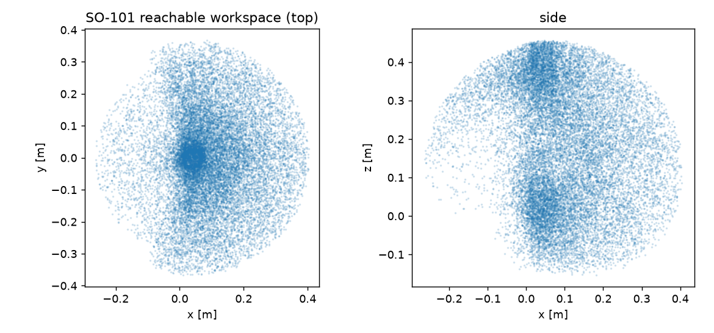

# Give your SO-101 math superpowers (5 minutes, no ROS)

You built the arm. LeRobot gives it learning. This gives it *math*: batched
inverse kinematics, a map of everything it can reach, and microsecond forward
kinematics fast enough for a real control loop. All of it on the official
SO-101 URDF, unmodified, pure Python, no ROS anywhere.

Every number below is from `python examples/so101_tutorial.py` on a laptop CPU.

## Setup (once)

```bash
pip install -e ".[dev]"                 # kinfast + torch
python examples/gallery.py --fetch      # downloads the official SO-101 URDF
```

## 1. Load the arm

```python
import kinfast
robot = kinfast.load("examples/assets/gallery/so101.urdf")
print(robot.joint_names)
# ['shoulder_pan', 'shoulder_lift', 'elbow_flex', 'wrist_flex', 'wrist_roll', 'gripper']
```

Exactly the joint order LeRobot uses. `robot.lower` / `robot.upper` are the
calibrated joint limits from the URDF.

## 2. Solve 1000 IK targets at once

Where should the joints be so the gripper reaches a point? Ask for a thousand
answers in one call:

```python
targets = robot.fk(robot.random_configs(1000))       # any (B,4,4) poses
q, info = robot.ik(targets, pos_only=True, restarts=8)
```

Measured: **99.7% of 1000 targets within 5 cm, 5.7 s on CPU.** It is
differentiable too, so it drops straight into a training loop.

## 3. Map what your arm can actually reach

```python
from kinfast import analysis
ws = analysis.workspace(robot.chain, robot.link_id(robot.ee_link), n=20000)
print(ws["max_reach"])    # 0.473 m
```



Useful the moment you plan a table layout: the SO-101's gripper covers a
0.47 m dome. Put the cube inside it.

## 4. Microsecond FK for your control loop

```python
fast = robot.compile()        # generates code specialized to the SO-101
T = fast.fk(q_list)           # one query
```

Measured: **15.9 us per FK call, all links (~63,000 Hz).** kinfast generates
straight-line code for your specific arm at load time, so a 50 Hz or even
1 kHz teleop/control loop spends a rounding error on kinematics.

## 5. Bonus: everything else in the same library

```python
tau = robot.inverse_dynamics(q, qd, qdd)     # torques (needs inertias in URDF)
t, qt, qd_t, qdd_t, T = robot.point_to_point(q_a, q_b)   # smooth, limit-safe motion
w = analysis.manipulability(robot.chain, q, robot.link_id(robot.ee_link))
```

Batched, differentiable, tested (88 tests, FK cross-validated against an
independent library on a real Franka Panda to 1e-7 m).

Questions and issues welcome. If your robot's URDF does not load, that is a bug
we want: open an issue with the file.
